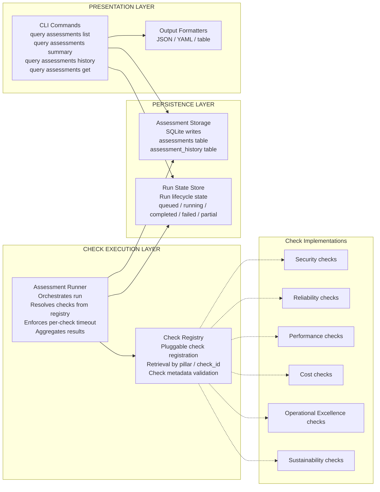
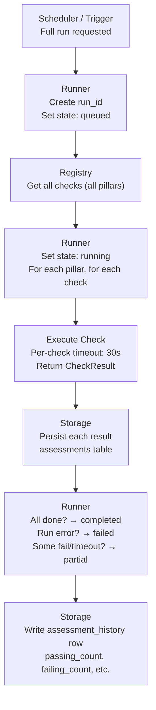
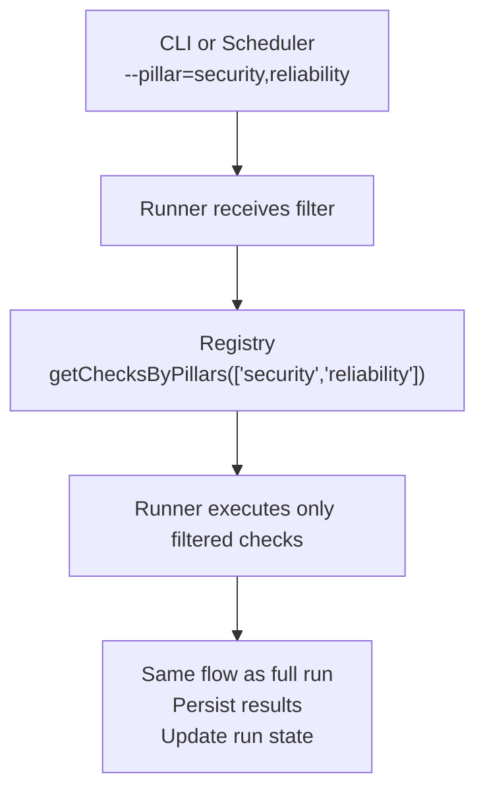
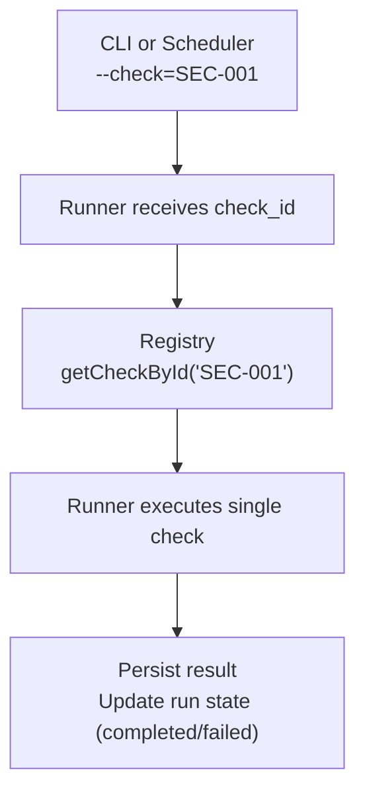

# Assessment Execution Architecture

This diagram defines the end-to-end architecture for Well-Architected assessment execution, persistence, and CLI consumption, including runtime boundaries, execution flows, and failure semantics.

## Component Architecture



## Runtime Boundaries

| Layer        | Components                    | Responsibility                          | Boundary Rule                          |
|-------------|--------------------------------|-----------------------------------------|----------------------------------------|
| Execution   | Runner, Registry               | Execute checks, aggregate results       | No direct DB access; passes data to storage |
| Persistence | Storage, Run State Store       | Persist results, track run lifecycle    | Receives structured data from runner   |
| Presentation| CLI, Formatters                | Query and format for consumption        | Read-only; no writes                   |

**Dependency Direction**: Presentation → Persistence ← Execution (no circular dependencies).

## Execution Flow: Full Assessment Run



## Execution Flow: Pillar-Filtered Run



## Execution Flow: Single-Check Run



## Failure Handling: Per-Check

| Scenario      | Behavior                                      | Result Status | Persisted |
|---------------|-----------------------------------------------|---------------|-----------|
| Check passes  | Normal return                                 | `passing`     | Yes       |
| Check fails   | Check returns failing result                  | `failing`     | Yes       |
| Check timeout | Runner enforces 30s limit, aborts check       | `timeout`     | Yes       |
| Check throws  | Runner catches, records error                 | `error`       | Yes       |
| Check skipped | Check returns skipped (e.g., preconditions)   | `skipped`     | Yes       |

**Per-check timeout**: 30 seconds (configurable). Runner uses `Promise.race` or equivalent.

## Failure Handling: Per-Run

| Scenario              | Run State | Behavior                                              |
|-----------------------|-----------|-------------------------------------------------------|
| All checks succeed     | completed | Normal                                                 |
| Some fail, some pass   | partial   | Partial results persisted; run considered done         |
| Storage unavailable   | failed    | Run aborts; no/minimal persistence; error logged       |
| Runner crash          | failed    | Run state may remain `running` until cleanup job       |
| All checks fail       | completed | Run completes; all results have failing/error status   |

**Run-level timeout**: Optional; full run may have max duration (e.g., 10 minutes) to prevent runaway runs.

## Data Contracts

### Runner → Storage

```typescript
interface AssessmentResult {
  id: string;           // e.g., asm_20260216_103045_sec001_a7f3b9
  run_id: string;       // Links results to run
  pillar: string;
  check_id: string;
  check_name: string;
  status: 'passing' | 'failing' | 'warning' | 'skipped' | 'error' | 'timeout';
  object_kind?: string;
  object_namespace?: string;
  object_name?: string;
  message?: string;
  remediation?: string;
  assessed_at: string;   // ISO 8601
  duration_ms?: number;
}
```

### Registry → Runner

```typescript
interface CheckDefinition {
  id: string;
  pillar: string;
  name: string;
  description?: string;
  run: (context: CheckContext) => Promise<CheckResult>;
}

interface CheckContext {
  k8sClient: KubernetesClient;
  clusterId: string;
}
```

### CLI → Storage (Query)

```typescript
interface AssessmentQuery {
  run_id?: string;
  pillar?: string | string[];
  status?: string | string[];
  since?: string;   // ISO 8601
  limit: number;
  offset: number;
}
```

### Run State

```typescript
interface RunState {
  run_id: string;
  state: 'queued' | 'running' | 'completed' | 'failed' | 'partial';
  scope: 'full' | 'pillar' | 'single';
  pillars?: string[];
  check_id?: string;
  requested_at: string;
  started_at?: string;
  completed_at?: string;
  error?: string;
}
```

## Module Ownership

| Module              | Path (planned)           | Ownership                          |
|---------------------|--------------------------|------------------------------------|
| Assessment Runner   | `src/assessment/runner.ts`   | Orchestration, timeout, aggregation |
| Check Registry      | `src/assessment/registry.ts` | Registration, retrieval             |
| Check Interface     | `src/assessment/types.ts`    | CheckDefinition, CheckResult        |
| Assessment Storage  | `src/database/assessment-repository.ts` | Persistence, queries        |
| Run State Store     | `src/assessment/run-state.ts` | Run lifecycle                      |
| CLI Commands        | `src/cli/commands/assessments.ts` | Query, format, output        |
| Scheduler           | `src/assessment/scheduler.ts`   | Trigger runs (cron, etc.)      |

## Circular Dependency Check

- **Runner** → Registry, Storage (writes)
- **Registry** → Types only
- **Storage** → Database manager
- **CLI** → Storage (reads), Formatters
- **Scheduler** → Runner

No cycles: Execution and Presentation both depend on Persistence; they do not depend on each other.
